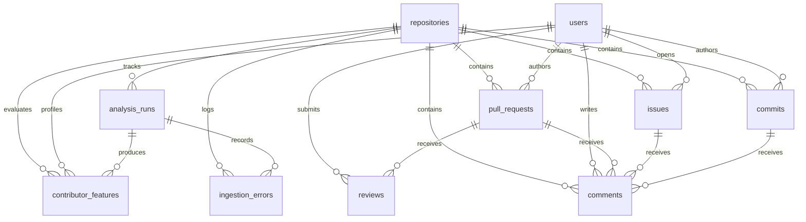

# ContributorPulse Database Schema & Entity Relationships

This document details the normalized relational database schema, domain models, entity relationships, constraints, indexes, and Alembic migrations for ContributorPulse.

---

## Requirements & PRD Alignment

- **FR-07:** Contributor profiling and identity management across repositories.
- **FR-09:** Pull request and code review activity tracking.
- **FR-11:** Issue interaction and collaboration metrics.
- **FR-13:** Onboarding velocity and first-time contributor journey features.
- **FR-14:** 30/60/90-day contributor retention calculations.
- **FR-15:** Contributor churn risk indicator and scoring.
- **FR-17:** Ingestion run telemetry, audit history, and error tracking.
- **Appendix B:** Core metric definitions (time-to-first-review, time-to-merge, retention status, activity frequencies).

---

## Domain Entities Overview

The database contains 10 normalized domain entities:



---

## Detailed Schema Specification

### 1. `repositories`
Stores repository-level metadata, stars, forks, and synchronization timestamps.
- **Primary Key:** `id` (BigInteger)
- **Unique Constraints:** `github_id`, `full_name`
- **Indexes:** `github_id`, `owner`, `name`, `full_name`

### 2. `users`
Tracks GitHub users, contributors, and bot identities.
- **Primary Key:** `id` (BigInteger)
- **Unique Constraints:** `github_id`, `login`
- **Indexes:** `github_id`, `login`, `email`

### 3. `pull_requests`
Stores pull request lifecycle details, sizes, first-time status, and merge timestamps.
- **Primary Key:** `id` (BigInteger)
- **Foreign Keys:** `repository_id -> repositories.id`, `contributor_id -> users.id`
- **Unique Constraints:** `(repository_id, github_id)`, `(repository_id, number)`
- **Indexes:** `repository_id`, `contributor_id`, `state`, `is_merged`, `is_first_time_contributor`, `created_at`, `merged_at`

### 4. `issues`
Tracks repository issues and discussion items.
- **Primary Key:** `id` (BigInteger)
- **Foreign Keys:** `repository_id -> repositories.id`, `contributor_id -> users.id`
- **Unique Constraints:** `(repository_id, github_id)`, `(repository_id, number)`
- **Indexes:** `repository_id`, `contributor_id`, `state`, `created_at`

### 5. `reviews`
Stores review states (APPROVED, CHANGES_REQUESTED, COMMENTED, DISMISSED) and review feedback.
- **Primary Key:** `id` (BigInteger)
- **Foreign Keys:** `pull_request_id -> pull_requests.id`, `contributor_id -> users.id`
- **Unique Constraints:** `(pull_request_id, github_id)`
- **Indexes:** `pull_request_id`, `contributor_id`, `state`, `submitted_at`

### 6. `commits`
Stores commit records, change volume, and author associations.
- **Primary Key:** `id` (BigInteger)
- **Foreign Keys:** `repository_id -> repositories.id`, `contributor_id -> users.id`
- **Unique Constraints:** `(repository_id, sha)`
- **Indexes:** `repository_id`, `contributor_id`, `sha`, `authored_at`, `committed_at`

### 7. `comments`
Stores discussion comments across pull requests, issues, commits, and reviews.
- **Primary Key:** `id` (BigInteger)
- **Foreign Keys:** `repository_id`, `contributor_id`, `pull_request_id`, `issue_id`, `commit_id`
- **Unique Constraints:** `(repository_id, github_id)`
- **Indexes:** `repository_id`, `contributor_id`, `pull_request_id`, `issue_id`, `commit_id`, `comment_type`, `created_at`

### 8. `contributor_features`
Stores calculated onboarding metrics, retention status (30/60/90 days), and risk scores (Appendix B).
- **Primary Key:** `id` (BigInteger)
- **Foreign Keys:** `repository_id -> repositories.id`, `contributor_id -> users.id`, `analysis_run_id -> analysis_runs.id`, `first_pr_id -> pull_requests.id`
- **Unique Constraints:** `(repository_id, contributor_id)`
- **Indexes:** `repository_id`, `contributor_id`, `is_first_time_contributor`, `is_retained_30d`, `is_retained_60d`, `is_retained_90d`, `retention_status`, `last_active_at`

### 9. `analysis_runs`
Tracks repository analysis executions, ingestion volumes, durations, and statuses.
- **Primary Key:** `id` (BigInteger)
- **Foreign Keys:** `repository_id -> repositories.id`
- **Unique Constraints:** `run_id` (UUID)
- **Indexes:** `run_id`, `repository_id`, `status`, `initiated_at`

### 10. `ingestion_errors`
Logs pipeline exceptions, stage failures, and raw payload error details.
- **Primary Key:** `id` (BigInteger)
- **Foreign Keys:** `repository_id -> repositories.id`, `analysis_run_id -> analysis_runs.id`
- **Indexes:** `repository_id`, `analysis_run_id`, `stage`, `occurred_at`

---

## Migration Commands

### Windows PowerShell
```powershell
# Apply all pending migrations
alembic upgrade head

# Rollback one migration step
alembic downgrade -1

# Rollback to clean empty database
alembic downgrade base

# View current revision and history
alembic current
alembic history --verbose
```

### Linux / macOS Bash
```bash
# Apply all pending migrations
alembic upgrade head

# Rollback one migration step
alembic downgrade -1

# Rollback to clean empty database
alembic downgrade base

# View current revision and history
alembic current
alembic history --verbose
```
